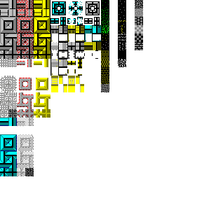

# untitled-roguelike-game


# Play: https://hectorvilas.github.io/untitled-roguelike-game/

## map editor: https://hectorvilas.github.io/untitled-roguelike-game/map-editor
## color palette generator: https://hectorvilas.github.io/untitled-roguelike-game/palette

---

Welcome to my new personal project! This time I'm making a roguelike (not to be confused with the real time modern ones).

Since I discovered this genre I always wanted to make one, just for fun. I've been a big fan of [Cataclysm: Dark Days Ahead](https://github.com/CleverRaven/Cataclysm-DDA) years ago, so I want to aim for something like this (procedural generated cities and a big depth of details), but maybe that's too much for my current skills, but I can always try.

I also tried to make one years ago on `C++` ([this one](https://github.com/HectorVilas/roguelike-old-project)) but my programming skills were very basic.

Today I'm learning frontend and I feel like I'm getting better and better with `JavaScript`. Of course, I'm not in a professional level, I'm still very far from this, but I feel confident enough with my current knowledge to make this project happen.

## What is this game about?
I'm still not sure what kind of roguelike I want to make. Something like Cataclysm would be great, but I'll start with a simple survival. I want to start with a simple map, a deserted island, and the objective should be simple survival. As the traditional roguelikes are mostly terminal-based, I can use a `grid` with rows and colums to place tiles (or chars) for each piece of map, so no `<canvas>` would be needed here.

# Progress:
I'm writing this readme 6 days after starting, 32 commits later, so the progress will be a resume.

## update(s) 1


This was my start. On `JavaScript` I made a simple map with an array of chars. This array got iterated and each char was written on each tile (`grid` cell). Great, no problems here, but I wasn't sure about the size of the game area. I decided to apply the same `vmin` values to the `width` and `height` properties, so it will always be a square and won't get stretched depending on the user resolution.


Then the main character, it can move from tile to tile, but I didn't had collisions yet, even the char(acter) can go outside the map. 


After making some textures with Stable Diffusion and replacing the `innerText` with `background-image` for each tile, I finally implemented some kind of collision. It wasn't hard, but I wrote and fixed it too many times for something that simple, mostly because I needed optional chaining to check outside the map. Now it works great.


I also made the play area have 3 layers on top of each other. Now I have layers for floor, tiles and walls, and ceiling.


And, finally, I added the ceiling. It just have a black transparent background, so the player knows where it is.

While I was at it, and while learning about good practices for modular code, I decided to apply this new knowledge on this prototype. Now each module have a "single responsability" and don't knowledge each other. After moving some functions from one to another, I finally separated each modular function to different modules, different `.js` files.

## what's next:
Now I have everything as it should be, everything is working, and I refactored the code many times to make it as easy as possible to read and understand.

For now the game's "viewport" is static, but I want a big map, so I have to refactor again to have the playable character always on the center, and let the viewport only draw what is around it, so the "camera" will always follow it, doesn't matter how big or small the world is.

---

# refactoring plan
This prototype is in a very, very early stage, so it's time to make another refactor. The way I wrote the code, it only works for maps with static size. The tiles on screen must be the same for the map, and I want a big world. I have to refactor almost everything, so maybe tomorrow I'll be making a new branch and writing again most of the code. My ideas:

## the map:
I want to have an overmap, and each tile must represent a 16x16 (or 24x24; or 32x32) map that will be drawn on screen. The player must be able to move from one chunk to another.

My idea is to create a set of rules to randomize this overmap. For example, if this is a city:

- generate houses next to the road
- if a road will go there, then it needs intersection every X tiles
- if I have X free space in a block with no connection with the road or any kind of path, a big house/shop/etc made of various chunks will occupy this space
- schools/big malls/fire departments/etc can't be generated too close to each other

and any other set of rules I may come up while working on it, then randomize each chunk, making lots of variants and placing them randomly. I know I'm aiming too high, but for now I'll manually draw the map.

I'm not sure yet how I'll manage to do this, but what I'm sure about is that I need the playable character in the center and the world, no matter how big or small it is, must be drawn around it when the player walks, instead of the player moving on screen.

## game save
This kind of game is not something you play for a few minutes and you are done. It's something the player may spend hours on it, so I'll make sure that whatever I come up with can be stored in `localStorage`. The next practice from the course I'm doing requires this, so I'll learn about this pretty soon, although doesn't seems hard.

This is the only way a website can generate a file, so I'll make sure to have it's content "dumpable" for backups.

## the code:
I've been reading again about the [OOP Principles](https://www.theodinproject.com/lessons/node-path-javascript-oop-principles), specially the [SOLID principle](https://duncan-mcardle.medium.com/solid-principle-1-single-responsibility-javascript-5d9ce2c6f4a5), and now I have a better understanding of how it should be done. I like this, and it will save me so much work in the future. I want this project to be long term, and doing everything right from the beginning is a must.

I also need a "handler", this module must be the only one receiving imports for the other modules, not the UI one like I did.

I was struggling thinking how I'm going to store the info for each tile, but I think I have a solution. Right now there's an array with 3 arrays, representing floor, walls and ceiling respectively. I wanted to make another array to store the "HP" of each tile (in case the player wants to damage or demolish a wall), but maybe I just need a different kind of array, storing the coordinates and HP of damaged tiles only. Then I'll have a small array that don't need a visual representation in the code, instead of a huge array with the HP of each tile.

Now, what if I want to set the room on fire? Or show a pool of blood on the floor? How about painted tiles? That would require lots of arrays, but storing each of those values on a single array of objects will be much less work.

I'm not sure how clear I'm expressing my ideas, but you will see once I manage to refactor the code and find a way to store the map.

## dev tools
Once I finally find a way to make the maps the way I want, I need a visual tool to draw maps, to draw chunks. When everything else is ready, I need a visual representation of the *blueprints*, with an input to paste some raw code, load it in the page and then be able to make changes. I also need an output, with also raw code, so it can be copied as a map. `JSON.parse` and `JSON.stringify` must take care of that.

## update 2

I deleted all the code and only left the functions empty. Most of the deleted code wasn't useful, this new way to draw the map was very different, plus I wanted to rewrite other things that worked but felt like bad coding.


Now, doesn't matter how big or small is the map, the player can walk around, have the camera following them and, as a little extra, other entities that are not part of the array containing the map can be drawn in their respective coordinates, as you can see with the second "@" on the GIF.

The tiles has been replaced with new ones, I've been looking for a software to make tileable images, but only found old, incompatible plugins for modern soft. For now I have some ugly tiles made with Gimp (I'm not an artist), enough for a reference on what is on screen.

### what's next
Now I have to implement again the collisions, to prevent the player from leaving the map or walk through walls and other obstacles. The previous code was good enough, but I want to make it compatible with any NPC too, not only the player, so I'm writing it again.

## update 3
Whoops! I got carried away and forgot to write my progress here. Now the game have collisions. When the player tries to move to certain tile, it will check if it's not blocked and have a floor. If those two conditions are true, then the player can move. There's no NPCs yet, but I guess the way I wrote this function will work with them too.

I also started working on a "dev tool", a map maker:


After thinking a lot, I found a way to make it possible. It starts with an empty map:

```javascript
let map = new Array(
  new Array(24).fill("GGGGGGGGGGGGGGGGGGGGGGGG"),
  new Array(24).fill("                        "),
  new Array(24).fill("                        "),
  );
  ```

Then, when the user draws on the map, they are not drawing directly on screen, but replacing a char on the map and then the map on screen redraws.

```javascript
  function editMapTile(argX, argY){
  if(tools.activeTool === "draw"){
    const layer = tools.layer;
    const x = typeof argX === "number" ? argX : this.dataset.x;
    const y = typeof argY === "number" ? argY : this.dataset.y;
    const char = tools.tile;

    placeTile(layer, x, y, char);
  }

  refreshMap();
};
```

### what's next
Why not just draw on the DOM? Simple: this edited map can now be "dumped" with `JSON.stringify` so it can be copied to a new file, then used as a blueprint in the future. Now I have to show it as text on screen, maybe with a modal. How about loading maps? It would require the map as text (copied from the js/json file itself) so `JSON.parse` can turn it back to code.

There's a missing tool right now: an eraser. I need to add one, with `<input type="radio">` so I can select which layer must be cleared.

## update 4
I kept working in the editor. Now each layer have a button to erase tiles on it's own layer. It's styled as a prohibited symbol using linear gradient and border, because it's faster than creating an icon.

The board has been moved to the top, and an unused column has been removed from the `grid`. I don't think I would need more stuff on screen.

The tiles list now make use of `grid` with `auto-fill` and it's overflow is automatic. Now I can add any number of tiles.

Then I added *Load* and *Save* buttons. The *load* one only shows it's corresponding modal, it's empty for now. The *Save* one will show the map array as plain text, so it can be copied.

And, finally, I implemented an undo action. There's a button for it, but only can undo once. I may add more levels of undo if I find myself needing it.

### what's next
I want to automate the tiles showing on the list. It should generate from `JavaScript`, using all the info from `tiles.js`. I also need to investigate how to add line breaks for `JSON.stringify`.

## update 5
> This repository has reached the 100 commits! So much work has been done on this one, but it's still a very, very early prototype.

The output to save the map now have line breaks. It will make it easier to read, even if that goes against the reason for the existence of this tool. Then I replaced the divs for the tools with `<fieldset>`s so I can add a `<legend>` to specify what kind of tile/menu is that. The tiles now have it's own name on it, to make it less confusing.

And, the best of all, now the load modal have a `<textarea>` to paste any saved map and load it on the editor!


If the format is incorrect, an error will be logged on console. I don't know how to check it first before trying to parse the text. If the format is valid, it will check it's length with the current map. If those are the same, the map gets loaded, but if the lengths differ, it will clear the text and add a placeholder as an error message.

### what's next
I think this tool is done, now I need more tiles and other assets (like furiture), but first I still need to automate the tile buttons generation. I'll try to find a way to make it possible.

## update 5
I've moved the code to two modular functions, now it's lest chaotic to follow, but then I had to move the `map` and `mapUndo` variables to the "global" scope (the `editor.js` is a module itself, I'm not sure how to call this scope).

with those variables inside a module, once the user *undo* or *load* a map (when the code applies `map = JSON.parse(JSON.stringify(mapUndo));`), the `display` module stops receiving the new map values, while the `editor` module containing the map will work but not send any new data to the other module.

I don't know what happened here, I've spent like an hour finding the problem and then another hour trying to figure it out, but I ended moving those to the "global" scope and problem solved.

I still want to know what happened. the `editor` module had the map variable on `return`. Maybe a getter and a setter would solve this, but still makes no sense, because before being modified by *load* or *undo* it can be read and edited with no problem.

Next, I worked on the tile buttons. Instead of writing them in the `HTML` each time I change the list, it will just read this list, get all the data needed from each item and place itself in their respective lists. Any future addition in this list will be automatically added to the editor.

```javascript
function placeTiles(){
  const floors = tiles["floor-tiles"];
  const walls = tiles["walls"];
  const ceilings = tiles["ceiling"];
  let isActiveSet = false;

  [floors, walls, ceilings].forEach(group => {
    for(const item in group){
      const groupClass = group === floors ? "floor"
      : group === walls ? "wall" : "ceiling";

      const listClass = group === floors ? "floor-list"
      : group === walls ? "wall-list" : "ceiling-list";
      
      let parent = document.querySelector(`.${listClass}`);
      
      const tile = document.createElement("div");
      tile.classList.add("tile-btn", groupClass, group[item].name);
      if(!isActiveSet) {
        tile.classList.add("active");
        isActiveSet = true;
      }
      tile.dataset.char = item;
      tile.style.backgroundImage = `url(${group[item].url})`;
      tile.innerText = group[item].name;

      parent.appendChild(tile)
    }
  })
};
```

The code is not that complex, but took me some time to figure out how to get the `key:value`. It wasn't hard, but had to investigate. I found lots of methods, but the one used here was the best one.

## update 6
No coding today, but I've been experimenting a little on Codepen and discovered this:


(Tileset for testing from [here](https://github.com/I-am-Erk/CDDA-Tilesets))

I can make my own tilesets! With those `CSS` lines I can pick any tile from it and, the best part, it will work with any resolution! The only adjust needed is how many tiles columns are.

Yesterday I decided what kind of visual style I want, and remembered that tileset from [CDDA](https://github.com/CleverRaven/Cataclysm-DDA), RetroDays. A minimalistic style with 16 colors would be great. Less details means less complex work just for the visuals, plus the retro and cozy feeling.

Here is what I've been doing today:


(this image will always autoupdate)

It's my first time making pixel art, and my first time making a tileset, but I think I'm doing fine.

The code for the tile drawing now needs a rework, but having everything on a single image will prevent any late image load while playing.

What I need to do now:

- set tile position for each one on `tileset.js`
- rewrite the way it's drawn on screen, always using the same image but with different coordinates.

For now I'll keep drawing tiles, then move to sprites. Once I have enough I'll rewrite the tile drawing code.

## update 7
I'm still working on the tileset. Revoked, brick and wooden walls are now rearranged and won't contain a window variant. The windows are now separated, so they can be reutilized on a separated layer, no matter the wall type.
The width of the tileset has been incrased from 8 to 12 tiles:
at the left are the walls and windows, at the right the floors
with an empty space for variants.

About the variants, I'm planning on adding an array on each tile info, so depending certain circunstances, the variant will be drawn, so it won't look the same on big areas with the same floor.

### what's next
As much as I want to go back to code, I still need more wall types, make up my mind with the tile arrangement and make a new spritesheet for characters and props. Once I have enough, I can finally refactor the code so it will draw from a tile/sprite sheet instead of looking for individual images.

## update 7
I created a new branch, rewrote the code, modified the tile properties and now the game shows the tiles from the tileset, a single image.

But I had a problem: Firefox will leave some visible lines between the tiles depending on the scale, even the tiles will have some "bleeding" from the neighbor tile. Opera doesn't have this problem. As I prefer Firefox for personal use, and to have multiple browser compatibility, I've been looking for a solution, experimenting, but without success. I decided to make the board pixel perfect, instead of using dynamic and percentage values, and now it works like a charm. To compensate for any other resolutions, I added two functions to change the pixel size and board scale:


### what's next

So now I have everything working. My next step will be making the wall adapt depending on the other connecting walls. Instead of a single tile, I have many others depending on the direction of the connecting walls. I need to adapt the code for the next configurations:


```
❌❌❌
❌✔️❌
❌❌❌

N        E         S        W
❌✅❌ ❌❌❌  ❌❌❌  ❌❌❌
❌✔️❌ ❌✔️✅  ❌✔️❌  ✅✔️❌
❌❌❌ ❌❌❌  ❌✅❌  ❌❌❌

NS       EW
❌✅❌ ❌❌❌
❌✔️❌ ✅✔️✅
❌✅❌ ❌❌❌

NE       ES        SW       NW
❌✅❌ ❌❌❌  ❌❌❌  ❌✅❌
❌✔️✅ ❌✔️✅  ✅✔️❌  ✅✔️❌
❌❌❌ ❌✅❌  ❌✅❌  ❌❌❌

NEW      NES      ESW     NSW
❌✅❌ ❌✅❌ ❌❌❌ ❌✅❌
✅✔️✅ ❌✔️✅ ✅✔️✅ ✅✔️❌
❌❌❌ ❌✅❌ ❌✅❌ ❌✅❌

NESW
❌✅❌
✅✔️✅
❌✅❌
```

I plan to check the north and go clockwise and get those strings, so depending on it, the proper wall tile will be chosen.

## update 8
The branch has been merged with main! Now the game works with a tileset, same for the map editor.


What I did:

For the game:
- rearranged tiles on the tileset
- adapted the test map to the new way it's drawn and read
- the game screen is now pixel perfect, and it's size can be changed, same for the number of tiles on screen
- created a new module to handle the tilesets, moved from GameLogic
- made the walls change tile depending on the angle, it's neighbor walls will shape it, doesn't matter the type of wall


For the map editor:
- adapted the code to read a different type of array
- the buttons now use the tileset instead of individual images
- added an optional parameter for the tile handler so it can read both game map and editor map
- adapted the function to draw on the map

This and some little fixes that won't worth to mention here.


Now everything works back to normal. It's fascinating how the wall adaptation works on the editor and how fast I can make a map. This will be used to create blueprints, for the map generation.

### what's next
I should use `Json` for the blueprints and tile properties. For now it can stay as `Js` files.

I also need a lot of new sprites and think how to use windows and doors as sprites with their own behaviours (the player must be able to open, close and break those, and the direction of those must depend on the connected walls).

Once I have some blueprints with windows, doors, furniture, etc, I need to make an overmap, and from this overmap a map will be generated in another variable. There's a LOT of work to do before this prototype becomes a playable game.

## update 9
The editor now have 100 levels of undo. Before making this happen, the `mapUndo` was a variable that copied the `map` one. Now `mapUndo` is an array, and it gett a push of `map`. It can store up to 100 map states (taking barely 30mb of ram, so could be higher), deleting the oldest entry when it's `.length` is bigger than 100. When the user undo, then the last entry on `mapUndo` gets copied to `map` and then `.pop()`ed.

About the tileset, I made 2 new walls and easily implemented them on the game with just two lines of code, other already drawn tiles has been added too.


The fences got dithering on top, to give the illusion that it's not as tall as the other walls (the player may be able to climb it).

The last changes has been replacing the long switch-case for a simple if-ese and then some minor changes to the tilest, to make it look more seamless.

### what's next
There's two things missing before I can start making blueprints for the map generator: walls/windows and sprites. Those wall openings will require a little change in the sprite drawing, to change it's orientation and connect with others. The sprites (mostly furniture) will only require to be drawn, most of them won't do other than block the path.

## update 10
I added two furnitures to the game and... I don't like it's look. I need more pixels and more colors.

I've been investigating, watching videos, reading about tilesets. Now I'm working on a 16x16 tileset, but I have nothing to show, because I changed the color palette so many times I redid the little I drew each time. Too many colors is a problem, too little colors is a problem, a missing color is a problem... so I made my own tool: a palette generator (link at the top of this README.md, with the other ones).


The math on this tool is confusing, I don't know too much about the science behind colors, but I know what each `HSL` value does, so it's enough to try. After trying a lot of combinations (on Codepen, that's why this tool appeared with a single commit) I think I found a sweet spot. Now I'll be able to make my own color palette, and even fine tune a little more with the tool at the right.